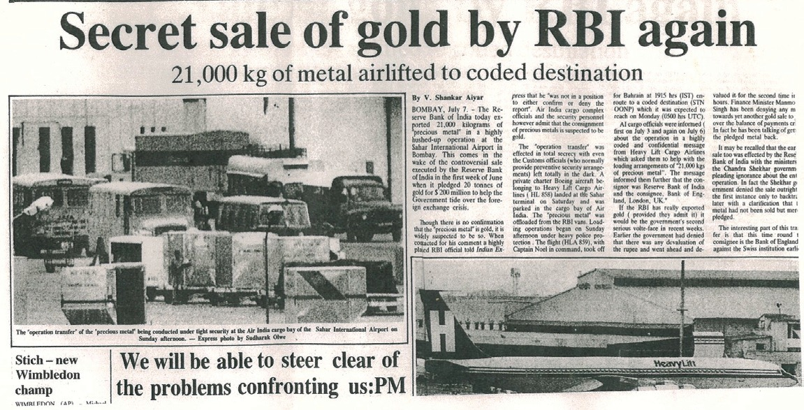
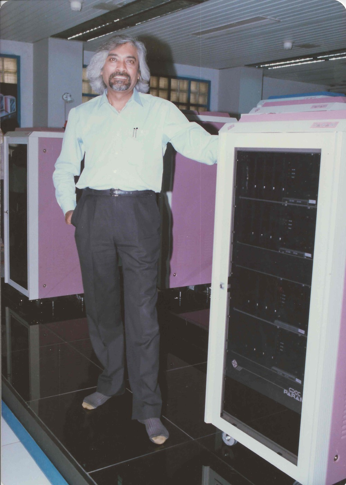
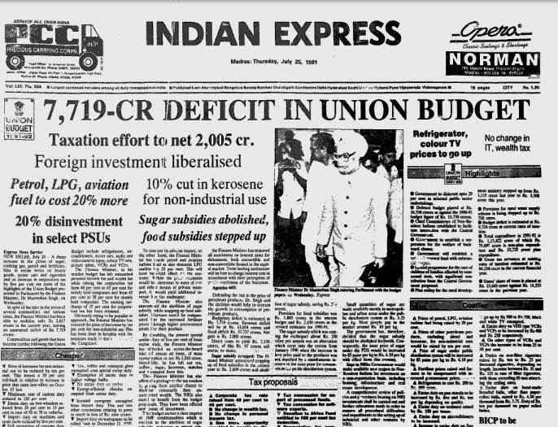
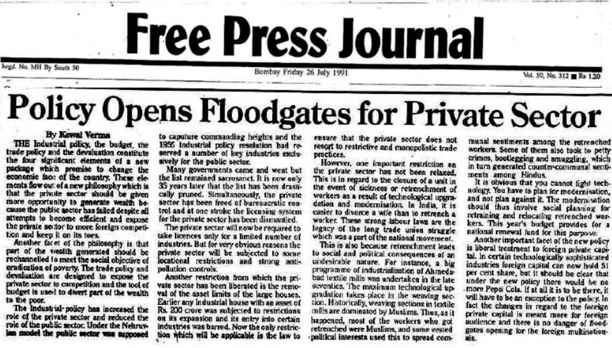
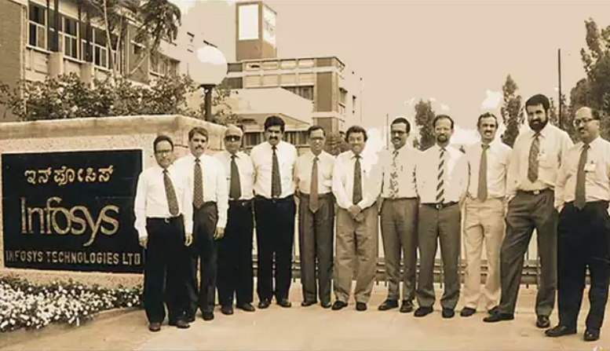
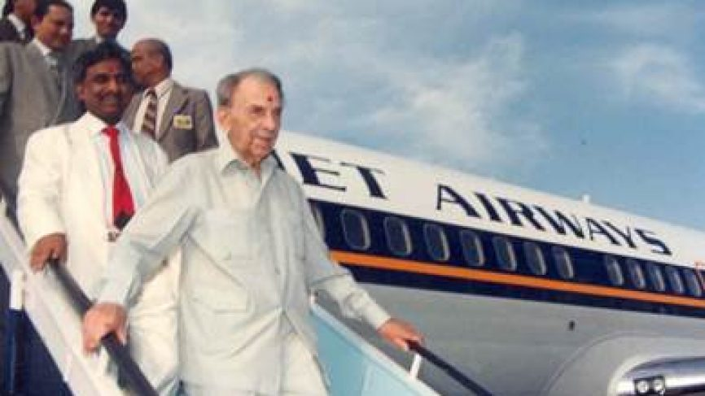
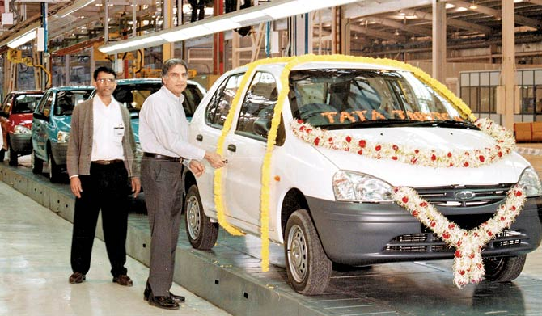
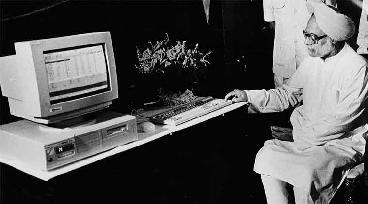

# Introduction
The License Raj system aimed at limiting the growth of the private sector and to bring the major chunk of the economy under the control of the State. It succeeded in boosting the public sector but severely limited the private sector. When Rajiv Gandhi rose to power in 1984, several changes were brought in keeping technological development in focus, the crucial step which most of the Indian businesses had neglected earlier. However, the lasting effects of the Licensing system were still to be felt when India was on the verge of a financial crisis in 1991. The incoming crisis was worse enough for the RBI to pledge 21 tonnes of gold to the Bank of England, to prevent defaults on the loan payment. The new Prime Minister P.V. Narasimha Rao along with his dynamic team brought in several sweeping changes that liberated the nation’s economy from the permit system and prevented a financial crisis. The liberalization was followed by a surge of business activities by private enterprises, all of whom had suppressed their operations owing to the precarious business landscape in India.

_India, forced to sell family jewellery to avert default and preserve honour. Source : New Indian Express_

> P.V. Narasimha Rao’s dynamic team brought in sweeping changes that liberated the nation’s economy from the permit system and prevented a financial crisis.

# Roots of Liberalization
The first wave of change came from the cabinet of Rajiv Gandhi who envisioned India to compete on a global scale in terms of technology and innovation. The key step to achieve it was diluting the license permit system. In the first two annual budgets of his cabinet, his government lowered taxes and tariffs and relaxed as many as 25 industries from requiring licenses for their operations. More diversification of products was allowed and the Monopolies and Restrictive Trade Practices(MRTP) scrutiny limits were restored to that of pre-license raj years. The number of industries that required to undergo MRTP scrutiny was also lowered to half and the number of companies that required the same was reduced to 15% of the previous value. Further, the telecommunication sector was opened to private enterprises in the form of equipment manufacturing. The Center for Development of Telematics (C-DOT), an autonomous agency was established to boost the Information and Technology sector. His cabinet also attempted to open up civil aviation to private enterprises. The reforms brought in by the cabinet of Rajiv Gandhi were welcomed by all political parties except the Communists. Hence, even when he was voted out of power in 1989, the wave of reforms did not stop.

_Sam Pitroda, founder of C-DOT alongside PARAM 8000, India’s first Supercomputer. Source : sampitroda.com_

# Imminent Crisis and Reforms
Beginning a technological influx to a huge nation like India cannot be done without sufficient capital and Rajiv Gandhi solved this problem with a short-sighted solution; huge amounts of foreign exchanges and loans. Further, the Gulf War of 1990 had shot up the price of oil which India bought from the world market to fulfill large demands. The political chaos from April 1991 to June 1991 had led to the withdrawal of 900 M USD worth of deposits from Indian banks by the non-resident Indians. The result was, when PV Narasimha Rao became the Prime Minister in June 1991, with dwindling foreign exchange reserves India was on the verge of defaulting on payments to foreign creditors. To avoid the impending financial crisis, the government had to initiate the liberalization process on a bigger scale. In the first budget of the cabinet, the MRTP Act was abolished. The industrial licensing system was also discarded for all major industries except for 18 industries. The list of industries reserved for the public sector was drastically reduced keeping key strategic sectors like defense still under the public sector. The investment limit for foreign companies in their Indian subsidiaries was raised to 51% up from the 40% limit imposed by the Foreign Exchange Regulation Act (FERA) in 1973. The automobile sector was opened up to foreign manufacturers and import and excise duties were reduced on many products. Further, private enterprises were allowed to participate in core sectors such as power generation and transportation infrastructure development. The Reserve Bank of India came up with the added reform of making Indian Rupee convertible on the current account, relying on the market demands. The depleted foreign reserves forced the Indian Rupee to be devalued although to a minor extent in comparison to the devaluation of 1966. Within two years, the tide of Indian Business was changed due to the landmark decisions taken by the cabinet of PV Narasimha Rao. Although he failed to gain another term of governance, the successive governments kept the momentum of reforms.

_Imminent financial crisis. Source : Indian Express_

# Impact of Liberalization on Industries
The reforms introduced came as a relief to the entire private business community and widespread business confidence was observed. The private enterprises began picking up new business opportunities that were held back during the license permit system. The Indian market began targeting global competition which was first envisioned by Rajiv Gandhi. Old business houses, who preferred to stay in businesses that they were comfortable in, entered into new lines of business. Expanding business activities encouraged the Banks and financial institutions to support new business ventures with generous schemes. Foreign investment which was vilified by the Indira regime was now widely sought after which was also supplemented by the rise of Venture Capitalists. Several multinational enterprises concentrated on India for its large market as well as labor force. The end customers were benefited immensely by these changes as the competition to provide better and cheaper products to the public increased many-fold.

> Foreign investment which was vilified by the Indira regime was now widely sought after which was also supplemented by the rise of Venture Capitalists.

_The private enterprises began picking up new business opportunities that were held back during the license permit system. Source : Free Press Journal_

> The end customers were benefited immensely by these changes as the competition to provide better and cheaper products to the public increased many-fold.

With sufficient foreign investments and generous schemes by financial institutions, new industries came to the forefront and offered competition to the older industries forcing them to become more efficient. The emerging industries can be broadly classified into four categories, the first category being the industries that began producing goods or offering services that had no domestic demand earlier. The prime examples of such industries are the Information and Technology industry. The IT industry falls into this sector because during the Indira regime there was no development and applications in the technology sector. During the Rajiv Gandhi government, several initiatives were taken to boost technology and its applications in various fields which led to the demand for software services in the 1990s. Some of the biggest software and consultancy enterprises that are still operational are Tata Consultancy Services, Infosys, Wipro and HCL. The turnover of the Indian software industry blew up from 430 Cr to 28,350 Cr in 10 yrs. This shows the massive boost that liberalization brought into the economy. Alongside the IT industry, Business Process Outsourcing grew into prominence by taking over the mundane tasks for large companies such as preparing reports, manual data entry and large scale data processing. They generated sufficient employment opportunities as well as saved sufficient revenue for larger companies. One of the most successful categories of BPOs is the Call centers which took over the task of providing support and maintenance services to the end consumers.

> The turnover of the Indian software industry blew up from 430 Cr to 28,350 Cr in 10 yrs.

_Infosys, the face of Indian Software Industry rose from 250 USD in 1981 to 12.8 Billion USD in 2020. Source : Infosys.com_

The second category of industries are the ones whose products were in demand but the industries were constrained by limitations on the supply side. An apt example is the Automobile Industry. After the liberalization moves, Foreign Direct Investments opened up the route for multinational auto manufacturers to tap into the Indian market which had a big demand for their product. The multinationals set up factories in India and brought in modern technological advancements along with them. This led to employment opportunities as well as the rise of a class of skilled workers. Besides foreign automobile manufacturers, indigenous design and development were also made possible which manifested into the popular car Tata Indica developed by TELCO. With the growth of the automobile industry, secondary industries also developed which supplied the automobile sector with auto parts, machine gear, etc. Telecommunication also comes under this category. Owing to a large population, there was significant demand for better communication facilities as the Posts and Telegraph department was unable to cope with the demand and Indian Telephone Industries was not able to manufacture the required infrastructure and products. When this sector was opened up for private participation, the Tatas, Godrej and BPL grabbed up the task and began producing the necessary equipment which helped telephones pervade throughout the country.

> The multinationals set up factories in India and brought in modern technological advancements along with them.

_Jet Airways chairman Naresh Goyal with JRD Tata disembarking from Jet Airways’ first flight on May 5, 1993. Source : CNTraveller_

The third category of industries is the ones that were limited by the monopoly of the public enterprises in their sector. For instance, civil aviation was the monopoly of Indian Airlines in the 1980s and hence no private enterprises could enter this profitable sector even though it was very poorly managed by Indian Airlines and needed significant upgrades. The Open Air Policy of 1990 and retraction of the Air Transport Act in 1994 ended the monopoly of public enterprises in civil aviation and private companies flocked to this sector soon enough the most prominent ones being Jet Airways and Sahara Airlines. To date, private companies lead public enterprises in the civil aviation sector in India. The competition offered by private enterprises forced the public enterprises to work on long-awaited upgrades not only in aviation but railways also. In the Electronic media sector, the rise of media houses like ZeeTV was able to break the total control over viewership enjoyed by Doordarshan and Star TV.

> Retraction of Air Transport Act in 1994 ended the monopoly of public enterprises in civil aviation and private companies flocked to this sector, the most prominent ones being Jet Airways and Sahara Airlines.

The fourth category consists of the industries that had large domestic demand but were executing on outdated machinery. Upgrading to the latest technology and infrastructure was difficult owing to the restrictions imposed on foreign investments. The Healthcare sector is a prime example in this category. Before liberalization, the sector was dominated by state and urban government hospitals with outdated facilities. Post-liberalisation, the many private hospitals with state-of-the-art facilities were established in India which came as a relief to the general populace. The most significant of them being the Apollo group of hospitals. The efficient and cost-optimal services provided by the hospitals attracted patients from abroad.

_Ratan Tata alongside Indica, first generation 1998. Source : WheelBHP_

The Tatas were finally able to do the historical unveiling of India’s first indigenously developed car, the Tata Indica. It was met with huge public reception as it broke down the shackles of dependence on foreign powers to develop a car, which was seen as a status symbol in those times. Not only was the Indica leading with a world-class design, but the manufacturing facility established in Pune hosted advanced machinery and robotics. Indica transformed Tata Motors from a truck manufacturer to a modern automobile company. The Indica was followed by a series of successful cars and SUVs such as Indigo. This brought a huge boost to the automobile sector in India.

# Change of Business Areas and new Strategies
Several other sectors grew up post-liberalization which was brought about with a boost of Foreign Direct Investment which exploded ten-fold from 234M USD in 1991 to 2.5B USD yearly in 1998–2003. The primary route of investment was buying equity shares in Indian companies. The blooming economic landscape attracted the expatriate Indian businessmen such as the Hinduja Brothers and Lakshmi Mittal to invest in India. The Insurance sector was backed by several multinational companies as twelve companies were established post-liberalization in India which broke the monopoly of Life Insurance Corporation and provided better schemes to the general public. Similarly, several cellular services were launched, aided by foreign operators. Although the foreign operators were not permitted to hold more than 49% of the total investments in a company, they collaborated with several companies like Reliance, Tata and Essar. This opportunity led to the rise of Bharti Enterprises who increased their turnover from 30 Cr INR to 500 Cr INR in 5 years. They are one of the leading cellular operators today.

> Foreign Direct Investment exploded ten-fold from 234M USD in 1991 to 2.5B USD yearly in 1998–2003.

The retail sector, which was never exploited by the public enterprises, was grabbed as a profitable opportunity and several retail stores and supermarket chains sprung up in the urban areas. Retail products that were of high demand among the Indian community abroad such as Kellogg’s, apparel brands like Levis and Arrow, personal care products like that of Rexona and several other goods were now available in several retail stores throughout India. Some of the widespread and popular retail chains were Pantaloon Retail, Lifestyle and Shoppers’ Stop. Several other enterprises such as Reliance, Tatas and also foreign enterprises like Walmart and Tesco were ready to tap into the Indian market too.

> Retail products of high demand among the Indian community abroad such as Kellogg’s, Levis, Arrow and Rexona were now available in several retail stores throughout India.

This period is also marked by a significant rise in Acquisition and Merger activities. The highest number of acquisitions or mergers happened in the telecommunication, chemicals and financial sector. The significant activities in the telecommunication industry show its relevance and potential at the then time. Even public sector companies were taken over by private enterprises. Some of the noteworthy acquisitions were the acquisition of VSNL by the Tatas and acquisition of IPCL by Reliance. The acquisition of IPCL helped Reliance on its easy to consolidate its position in the Petrochemical industry which ultimately laid the foundation of a strong business for the Reliance group of industries and projected them to the leading business enterprise in India overtaking older groups like the Tatas and Birlas.

The Banking sector which was dominated by public financial institutions developed to support the government in building large infrastructural projects were not intended or capable to support the exponentially growing private sector. With the new financial norms, many enterprises resorted to establishing private banking firms themselves. This resulted in the establishment of up to eight new private financial institutions such as HDFC Bank, ICICI Bank, IDBI Bank and Kotak Mahindra Bank. All of the aforementioned institutions still dominate the private banking sector today. The private banks provided a range of schemes not limited to industries only, but also individuals. They also took advantage of the rising Computer technology backed by the IT sector and also BPOs. Starting from CitiBank’s experimental services like providing Credit Cards and ATMs, the use of technology to cut costs and provide better services pervaded the entire sector. Besides, the banks soon started catering to the needs of the general populace by providing Consumer Loans and also Housing loans.

> Starting from CitiBank’s experimental services like providing Credit Cards and ATMs, the use of technology to cut costs and provide better services pervaded the entire sector.

The growth of Venture Capitalists can also be considered as the fruits of liberalization. The VC firms which were largely confined to the IT sector increased the total investments from 90 Cr INR in 1997 to 4800 Cr INR in the 2000s. The Bombay Stock Exchange, which was seen as a powerful source of capital since Dhirubhai Ambani used it to rise into prominence, saw a two-fold increase in the number of companies enlisted in a span of 8 years even after the establishment of the National Stock Exchange which diverted a significant number of companies from BSE. While Sensex showed an average annual increase of around 2% till the 1980s, it appreciated providing a 14.5% average increase between 1992 and 2005.

_JULY 23, 1994: Finance Minister Dr Manmohan Singh inaugurates the National Stock Exchange (NSE) by giving a computer command at the Nehru Centre in Bombay. Source : Indan Express_

The most distinguishing feature of post-liberalization entrepreneurship is knowledge-based enterprises such as Biocon, Dr. Reddy’s Laboratories and Mindtree. They introduced the much-needed culture of technological progress and innovation in Indian business practices. This period also witnessed the rise of entrepreneurial women, although it cannot be wholly attributed to liberalization. It was estimated by the Federation of Indian Chambers of Commerce and Industry(FICCI) that the growth of women in business ranks was 100 percent between 1996 and 2001. Leading examples of women entrepreneurs were Kiran Mazumdar, who founded Biocon, Sumati Morarjee, who led Scindia Steam Navigation Company and Anu Agha, who led Thermax Limited. While Sumati Morarjee and Anu Agha succeeded the family business, Kiran Mazumdar’s Biocon was solely the result of her technical expertise as well as entrepreneurship abilities and she led Biocon to perform annual sales of 100 Cr INR by the end of 1990s decade.

> FICCI estimated that the growth of women in business ranks was 100 percent between 1996 and 2001. Kiran Mazumdar’s Biocon was solely the result of her technical and entrepreneurship abilities. She led Biocon to perform annual sales of 100 Cr INR by the end of 1990s decade.

Post-liberalisation witnessed a radical change in the global view of Indian business. For the first time in centuries, Indian companies were actively operating and acquiring companies in foreign lands. Surprisingly, ONGC, a public sector company, was the largest investor in companies abroad as it expanded and acquired subsidiaries in Russia, South East Asia as well as the Middle Eastern countries. Among the private enterprises, Reliance acquired oil blocks in Yemen, telecom company Flag Telecom and Treviara, a company based in Germany. Not far behind, the Tatas acquired Daewoo in Korea, Natsteel in Singapore and international communication and network provider Tyco Global Network. The Aditya Birla group expanded its operations to South-East Asia, Egypt and China. Apart from the old business families, the newer drug manufacturers and pharmaceutical companies such as Dr. Reddy’s Laboratories, Zydus Cadila, Nicolas Piramal and Ranbaxy too expanded overseas.

# Conclusion
More than 25 Indian companies appeared in British and American Stock Exchanges in 2000 as compared to 0 in 1991. Indian companies invested 9000 Cr INR in foreign acquisitions and acquired as many as 25 foreign companies in diverse sectors. The huge demand for goods as well as services from the Indian population attracted the attention of several foreign enterprises. Several Indian companies acquired foreign firms and emerged as global leaders. A significant shift in marketing tactics by the companies could be observed in the later years of liberalization. Further, stiff competition has resulted in a healthy improvement of products and services. The much-neglected area of technical expertise and Research and Development was also brought to focus as companies prioritized modernizing their manufacturing facilities. The liberalization schemes which were initiated as a desperation move to prevent an imminent financial crisis acted as a boon to the Indian economy with far outreaching consequences. By the end of the 90’s decade, the freedom provided to the private enterprises helped India to rise as a global market hub not only as a consumer but also as a producer. While India was nowhere to be seen in the list of largest economies in 1990, suddenly India became the sixth largest by the end of the millennium.

# Bibliography
* The Concise Oxford History of Indian Business by Dwijendra Tripathi, Jyoti Jumani
* Half — Lion: How P.V Narasimha Rao Transformed India by Vinay Sitapati
* Portfolio book of Great Indian Business Stories