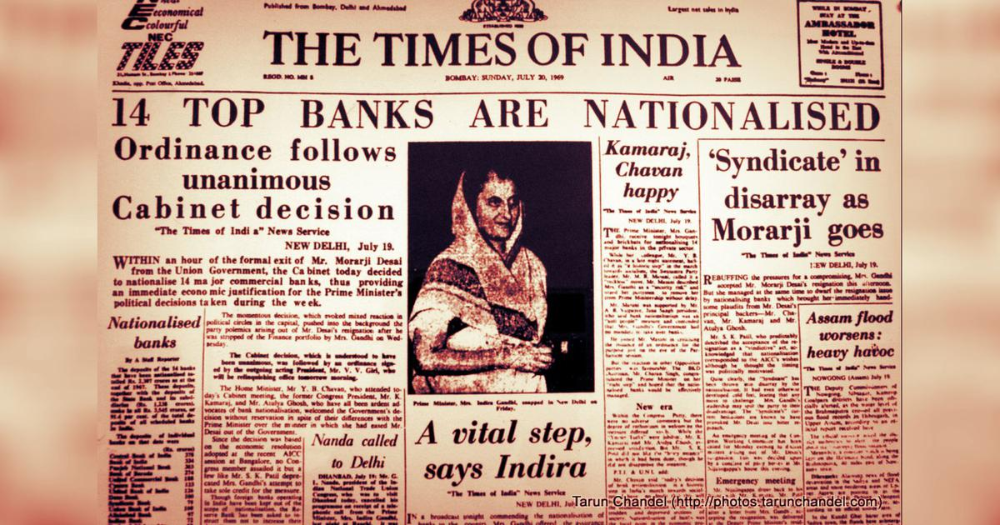
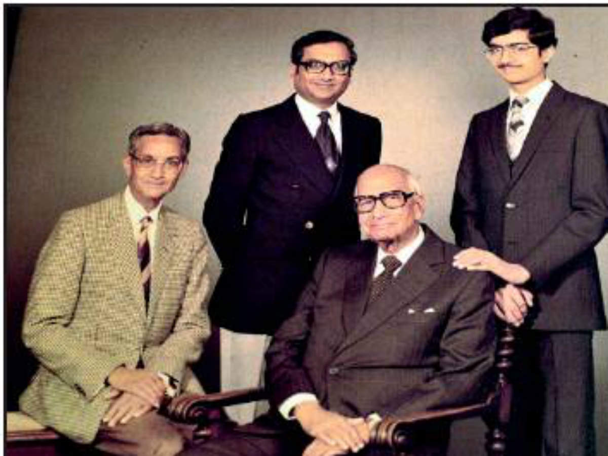
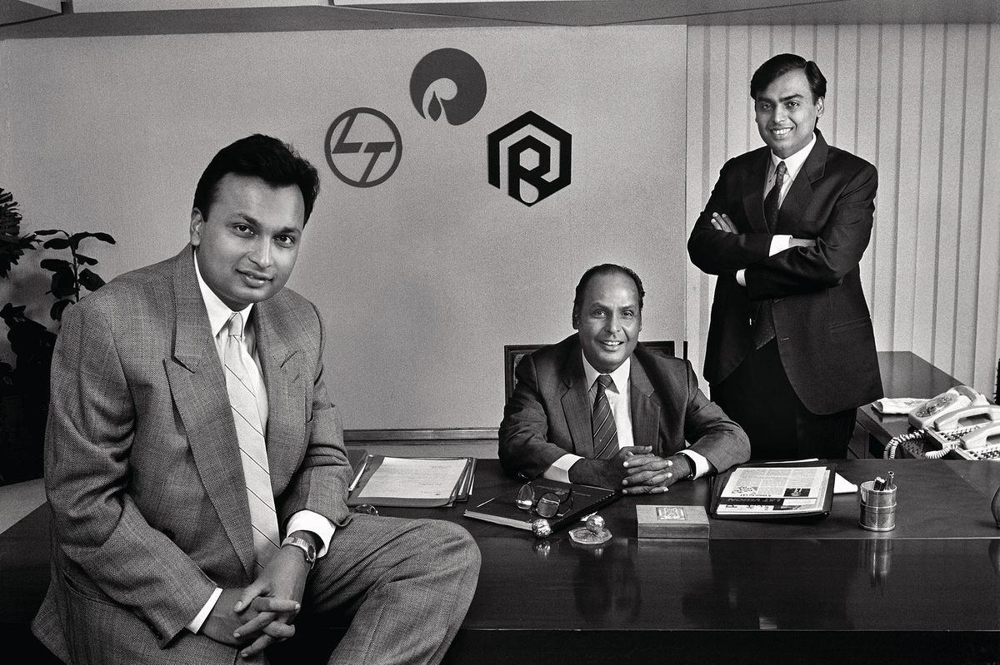
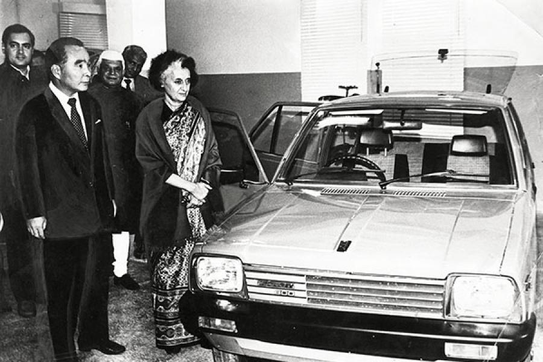

# Introduction

The 1960–70 decades unfolded multiple historic events for the Indian subcontinent. Marred with 3 wars and a general shift of the government policies towards strong leftist ideologies after the death of Jawaharlal Nehru, the Indian business scenario had to go through a massive shift from rapid industrialization plans facilitated by the second 5-year plan during the Nehruvian era to pervasive and almost monopolistic public sector companies under Mrs. Indira Gandhi’s cabinet. The events that led to the Licensing system have their roots in the political and economic scenario of India in the 1970s decade. The License Raj had strong impacts on the rising economy of a two-decade-old democracy which had been gearing up for massive industrialization beginning with heavy machinery, development of Aviation and Railways, health care, housing and developing “Temples of Modern India” as aspired by Jawaharlal Nehru.

# Politico-Economic Scenario

The idea of reservation of a certain sector exclusively for the state and regulating industries by issuing licenses was first introduced in Industrial Policy Resolution, 1948 and Industries (Development and Regulation) Act, 1951. The Industrial Policy Resolution Act of 1948 established government monopoly in the sectors of Atomic Energy, Armaments and Railways. Six industries were classified as Basic or Key industries and it was modeled on a Public-cum-Private sector basis given that existing private enterprises were allowed to continue in this sector, but henceforth only public enterprises were allowed to enter these industries. Industries designated this class included Aircraft manufacturing, Shipbuilding and manufacturing equipment for the telecommunication industry. It also had clauses that gave the government a general control over the private sector enterprises. The objective of the Act was to provide the Government better control over the economy to ensure a better distribution of wealth and to reduce unemployment along with the large gap between rich and poor. It would also help the government protect cottage industries and small scale enterprises. The Act expected the public and private sector enterprises to coexist in harmony. While the private enterprises dealt with consumer goods, the government had the reins to build nation-building projects such as Power Plants and Dams. But after the death of Nehru, with Indira Gandhi at the helm of Indian Government, the delicate balance between state intervention and freedom of private enterprises tilted towards the state.

> The objective of the Act was to provide the Government better control over the economy to ensure a better distribution of wealth and to reduce unemployment along with the large gap between rich and poor.

Aligning with the socialist policies of the government, the financial sector needed to be under government control ideally. Further, the welfare schemes designed by the government needed financial support and this was a hurdle since most of the financial sector remained under private enterprises. Hence in 1969, 14 major banks that held 85% of the total bank deposits were nationalized through the Banking Companies (Acquisition and Transfer of Undertakings) Ordinance, 1969 by the Indira Gandhi government. The Act aimed at ending the private control over the financial institutions which will help the government approve and carry out its welfare policies.

_Source : scroll.in_

Pushing back the private enterprises’ control over the economy, the Monopolies and Restrictive Trade Practices(MRTP) Commission was established in 1969 which mandated business groups with assets worth more than 200 Cr INR to undergo scrutiny and clearance by the group before any substantial expansion. The Commission aimed at preventing the concentration of economic power in the hands of few rich companies and public sector enterprises were exempted from this scrutiny. In effect, the Act completely stopped the growth and expansion of private-sector industries.

> MRTP Commission, established in 1969 mandated business groups with assets worth more than 200 Cr INR to undergo scrutiny and clearance.

The Industrial Licensing Act of 1970 categorized industries based on their total assets into Core, Middle, Non-Core Heavy Investment and De-licensed Sectors. The Act required private industries exceeding a certain asset limit, to be scrutinized and to obtain licenses to continue their operations. The number of licenses needed for big industries starting from importing supplies to exporting products was often large and these acts constricted their operating potential. The strong and often unhealthy rivalry among the companies to gain licenses was the breeding ground for growing corruption and intermixing of politics and business affairs. Further, the Foreign Exchange Regulation Act(FERA) was passed in 1973 and it required the multinational investors to dilute their share in their Indian subsidiaries to 40%. It also imposed severe restrictions on the exchange of foreign currency among individuals as well as industries. This act severely limited foreign investments in India. Thus, the acts passed by the government gave an impression to the general populace that Indira Gandhi is against private enterprises and vests total power with the state which is in contrast to Jawaharlal Nehru’s policies of striking a balance between socialist and capitalist state of the economy.

> Acts passed by the government gave an impression to the general populace that Indira Gandhi is against private enterprises and vests total power with the state which is in contrast to Jawaharlal Nehru’s policies of striking a balance between socialist and capitalist state of the economy.

Meanwhile, the National Emergency was imposed in 1975 which lasted till 1977 and was followed by a change in government. For the first time since independence, Congress was not the ruling party and the new Government, formed on the foundation of opposition to Congress was preoccupied with internal disputes and disintegrated soon enough when Indira Gandhi rose to power again in 1980. The tumultuous state of power and change in policies of Government in rapid succession resulted in the negative growth of almost all industrial sectors.

# Impact on Private Enterprises

Except for Agriculture production whose consistency can be attributed to the ongoing Green Revolution, all major sectors responded with negative trends in production and profitability. With severe limitations on the supply of raw materials and a noose on expansion capabilities, the private industries couldn’t have performed better. Most of the older private companies followed a similar route i.e. they did not open up new ventures, but judging the demand tuned up their production. Several companies resorted to expanding into overseas ventures, especially in South-East Asia. While the growth of private industries was curbed, public sector companies grew at a rapid pace taking advantage of the almost monopolistic power vested in them. Despite the decline in key industries like textiles, many ventures did rise successfully amidst the growing regulations on private enterprises.

> All major sectors responded with negative trends in production and profitability. Most of the older private companies did not open up new ventures, but judging the demand tuned up their production.

The Tatas, who were the leading private company in the Indian business market, had had their sanction requests either rejected or stalled with the Congress government. The reason can be explained by the findings of the Dutt Committee of 1967, which reported strong connections between large industrial houses and politicians and prevalent corruption in the licensing systems. Due to the stalled sanctions, the Tatas had not undertaken any significant expansions into new business areas. With existing industries slowed down, they lost their leading position in Indian business to the Birlas during the Emergency in 1976–77. When Janata Dal formed the government in 1977, the pending sanctions and requests were approved and the Tatas were able to undertake many key projects in Africa and West Asia. In India, they successfully expanded Tata Engineering and Locomotive Company (TELCO), built a thermal power plant and modernized Tata Iron and Steel Company (TISCO). By the early 1980s when the License Raj had begun getting weaker, the Tatas had already resumed their initiatives and also acquisitions. For instance, 14 new companies were established in the 1980s and they regained the peak position in Indian business.

The Birlas, instead of venturing into unknown territories concentrated on maintaining their existing ventures. With favorable development projects arising in South-East Asiatic nations, they concentrated on setting up new ventures in Indonesia, Malaysia, Thailand and the Philippines. With success in overseas investments, the Birlas were propelled to the top position in Indian Business in the late 1970s. While favorable business conditions returned to India in the 1980s, the Birlas were split into 6 independent groups following the death of GD Birla. After the split, the Birlas did not expand into new business areas.

_GD Birla (third from left), with son Basant Kumar (left), grandson Aditya Vikram and great-grandson Kumar Mangalam (right). Source : Times of India_

Just like the Birlas, the Thapars took overseas operations. They established several production plants in South-East Asia and West Asia. The Kirloskars dealt with agricultural operations and hence had the advantage of the rising agricultural sector. They too set up ventures overseas in Kenya and Malaysia. Several companies kept on their existing practices and did not expand or contract. For instance, Mahindra remained operational only in its automobile sector, Goenkas and Khaitans in acquisition and Bajaj in the production and distribution of the popular Bajaj Scooters. The drive of Indian business enterprises to chase opportunities overseas was a strong indication of the rising distrust of the private sector on Indian business and the dwindling opportunities for growth.

Added to the troubled Indian business scenario, several companies that were established and run by business families witnessed splits in the company operations when the next generation family members rose to the forefront. Different heirs used to run different operations of the company independently and hence the conglomerates were split into several independent enterprises. Although splits in the company slowed down the progress, it did not cease their operations altogether. The split of huge conglomerates with diverse operations into several factions of specialized industries was often followed by aggressive acquisitions. Most noted splits are the ones of Birlas, Goenkas, Mafatlals and Shri Rams. While the trend of splits was often observed in companies with third-generation family members at the helm, younger companies and business families in South India did not follow the trend. The reason can be attributed to the fact that younger companies have a stronger drive and centralized management system.

> The split of huge conglomerates with diverse operations into several factions of specialized industries was often followed by aggressive acquisitions.

While the older companies persisted although with reduced efficiency, a handful of new companies still grew up into vast enterprises and their number was very less in comparison to that of the Nehruvian era. The most notable examples are the Ambanis, Nirma group, Shahra group, Biocon and Lohia. Most notable among them is the Reliance group led by Dhirajlal Ambani, more popularly known in Indian households as Dhirubhai Ambani for his famous rags to riches story.

Perhaps Dhirubhai Ambani is the only person who used the License Raj schemes to his significant advantage. He also used his extensive political and corporate connections as well as share market instruments to gain huge momentum and raise capital. His initial venture was Reliance Textiles, a modest company with no significant outreach in Gujrat. He took advantage of a government scheme in 1971 which allowed him to import high-quality polyester yarn against the export of art silk which his company produced. This enabled him to import high-quality raw material, produce fine products and sell the remaining raw material to other producers at a large profit. When he needed to expand his venture, to raise the capital he made the company public and issued debentures instead of the conventional shares in the stock market. He also offered high dividends to the shareholders to gain their loyalty and raise the demand and valuation of Reliance stocks. By 1977, their sales had seen a hundredfold growth and they invested capital in modernizing their machinery which liberated them from the dependency on imports for production. Soon, Reliance entered the Petrochemical industry and used its previous tactics of raising capital through debentures and giving high premiums to the shareholders. Dhirubhai Ambani had the business acumen to put forth structured financial proposals and also political influence which extended up to Mrs. Indira Gandhi, which helped him to gain licenses against other competitors. He adopted a two-fold strategy of self-reliance and speed, which enabled Reliance to build projects and start production in a very short duration. Hence, while the rest of the textile industry was failing to modernize the machinery, get proper licenses or meet the demands, Reliance emerged as the undoubted champion of the License Raj era.

> Perhaps Dhirubhai Ambani is the only person who used the License Raj schemes to his significant advantage. He adopted a two-fold strategy of self-reliance and speed and often gave away tenders at upto 2.5x price if speed was assured.

_Anil (left) and Mukesh (right) flank their father, Dhirubhai Ambani, in 1986. Photographer: Raghu Rai/Magnum Photos/Trunk Archive_

The change in management structure and the adoption of unconventional business approaches were not limited to Reliance. The private sector was still largely under the control of business families and several business leaders were better educated and professionally qualified in comparison with the leaders before them. Hence, the management decisions taken by them were often better informed and well-thought-out as opposed to the speculative tendencies used by pre-independent Indian business leaders. While the leaders improved upon the management, they did not focus on technological research and development of their products. They preferred to collaborate with specialized enterprises abroad for technological innovation. Further, as the businesses expanded beyond the limits where the wealthy families could finance them, they turned to the public financial institutions and shareholders for investment. Hence, the public sector financial institutions gained partial control over the management of the private enterprises and in many cases saved them from acquisition by aggressive corporate buyers.

The effects of the License Raj were felt overseas too. As Indira Gandhi rose to power, expatriate Indian businessmen began breaking up their Indian subsidiaries owing to the insecure business position and growing radical business restrictions imposed especially on the multinationals and foreign investors. The Foreign Exchange Regulation(FERA) Act of 1970 and several other acts imposed by the government led to a decline in foreign investment. FERA particularly affected the Oil and Petroleum subsidiaries in India who were nationalized soon enough. While some foreign subsidiaries were nationalized, companies like Hindustan Lever and Indian Tobacco Company(ITC) were not affected by FERA owing to the dilution of the foreign holdings and installation of Indian management, which made them not so different from an Indian enterprise. ITC eventually began expanding its business operations even under inspection. They diversified their operations from tobacco to the hospitality industry and paper products which still exist today and gather a considerable chunk of their revenue.

With severe restrictions on private enterprises, the Indira regime wanted to boost the public sector and they did so. 131 new enterprises were added to the public sector in the post-Nehru era which is close to double the number of enterprises that were set during the Nehru government. While the Nehru government had reserved key sectors for the state and wanted the public and private sector to cooperate and synchronize their operations to ensure uniform economic distribution, in the current regime public enterprises intruded into end-consumer products such as drugs, hospitality and food-processing. They also dabbled in national and international trade, consultancy services and communication services. The public sector enterprises followed the means of nationalization and acquisition to gather their ground. Several failing private enterprises were taken over by the state, especially in the textile sector rendering a large number of people unemployed. Expatriate firms also gave up their important holdings owing to the restrictions imposed on them, which had paralyzed their operations.

# Rise of Public Enterprises
The public sector did bring several positive changes to the Indian economy. They ventured into sectors that were otherwise shunned by the private enterprises and opened up services even in remote parts of the nation. They also opened up employment opportunities to the section of the society which was largely neglected by the private enterprises. With a strict focus on profit, the private enterprises had concentrated development of certain geographic areas in India which would aid their operations. Hence, a large section of India that lacked natural resources was left undeveloped. As public sector enterprises took upon the challenges of opening up more employment opportunities as well as new sectors of business, they also brought a wave of industrialization to the less developed areas. Hence, they brought along changes of social good.

> Public enterprises opened up employment opportunities to the section of the society which was largely neglected by the private enterprises.

Although the public sector did bring relief to the neglected strata to society as well as geographic regions, they did not fare well strictly speaking in a business narrative. The public sector enterprises suffered losses successively and the failing enterprises which were acquired were not reformed or converted to profit-making bodies. They remained the worst performers from a business perspective by providing 3–5% of return on investment as compared to private enterprise who provided 17–23% returns from 1976–77 to 1986–87. The profits seldom came from enterprises that faced competition from private counterparts. This indicates that even with added restrictions, private enterprises outperformed public enterprises mostly.

The reasons for the dismal performance of public enterprises can be attributed to the managerial weakness of the enterprises. Added to managerial inefficiencies, was the problem of overmanning, corruption and nepotism. Constant interference by the ministers in crucial operations of a business such as pricing and supplies and also lack of encouragement to modernize or expand the existing infrastructures added to the woes of the public sector. Not being able to segregate business management and political affairs, the ministers appointed top administrative positions and often left crucial management positions vacant. With such political interference masquerading as business management, political affairs devoured any significant economic growth that the public sector might have brought along with the significant advantages that they were armed with.

While most of the public sector companies suffered, some enterprises outshone even the best private sector companies and competed on a global scale. Some of the instances are Bharat Heavy Electricals Limited, Indian Oil Corporation, Oil and Natural Gas Commission and National Thermal Power Corporation. They had a common similarity that they were all working in core sectors and were established during the Nehru government. Maruti Udyog Limited, although not strictly a public enterprise given that it was jointly owned by Suzuki Motor Company, gave India its first “People’s Car”, Maruti 800. The instant success of Maruti 800 forced the existing dormant car manufacturers Premier Automobiles and Hindustan Motors to work on the long-awaited upgrades to its product. The emergence of Amul as a highly diversified multi-product enterprise dispels the assumption that enterprises couldn’t have expanded amidst the precarious business landscape in India. Although both Maruti and Amul were joint ventures between government and private enterprises, their success story refutes the claim that the growth and development of enterprises are the territories of the private sector.

> Maruti Udyog Limited, jointly owned by Suzuki Motor Company gave India its first “People’s Car”

_Prime Minister Indira Gandhi, with Rajiv Gandhi and ND Tiwari in the background, inspects a model car before inaugurating the Maruti factory in Delhi on December 14, 1983. Source : The Hindu_

# Conclusion
Despite the business slowdown amidst multiple trade restrictions and splits, the business sector grew among the general populace as more people took up business as a profession. While private sector companies were maintaining a precarious existence, the general populace had better hopes for the public sector. Failure of the public sector to meet the expectations of the general populace caused greater resentfulness. While it might give an impression that private sector enterprises bring all good to a nation, their social responsibilities and duties are often overlooked. They do not bring all-round development and economic distribution to a nation. While public enterprises played a role in the aforementioned duty, they were not able to maintain a healthy and strong economy. Early leaders, through the Industrial Policy statements of 1948 & 1956 provided a framework for the public sector where the public sector would act as a facilitator to the private sector rather than displacing the private enterprises altogether. They did not expect the invasion of the public sector into end-user requirements. Further, many enterprises like IOCL, BHEL planned by the Nehruvian government were abandoned in the 1970s and the business areas which were either established or acquired in the 1970s were suffering losses. This raises a “what if” question; what if the enterprises planned by the Nehruvian government were allowed to progress and the public enterprises confined themselves to the key sectors? In my opinion, such a delicate balance between a Capitalist and Socialist economy is hard to maintain with successive changes of governments along with their policies every five years and a more flexible approach towards the business policies must be maintained based on the ever-changing global business landscape.

> A delicate balance between a Capitalist and Socialist economy is hard to maintain with successive changes of governments along with their policies every five years.

# Bibliography
* The Concise Oxford History of Indian Business by Dwijendra Tripathi, Jyoti Jumani
* Portfolio book of Great Indian Business Stories
* [Source 1](http://indiabefore91.in/license-raj)
* [Source 2](https://shodhganga.inflibnet.ac.in/bitstream/10603/52933/9/09_chapter%202.pdf)
* [Source 3](https://www.gktoday.in/gk/license-raj-in-india/)