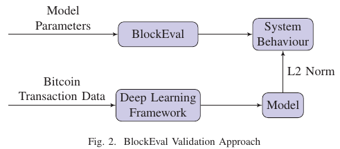

*Acknowledgement : I am an author of the paper and the work stemmed from my Bachelor's Thesis along with [Shashwat Jolly](https://blog.shashwatjolly.com/) and [Dr. Kalpesh Kapoor](https://www.iitg.ac.in/kalpesh/). Please reach out to me for any clarifications or suggestions.*

## Terminologies and Pre-requisite knowledge
* Blockchain - Block, Node, Fork, Transaction, Mining, Consensus, Proof-of-Work
* Artificial Neural Networks
* XGBoost

## Introduction
* BlockEval - mimics the behaviour of concurrent operations that occur in a real-life blockchain system.
* Correctness of simulator performed by comparision with independent model built from the real Bitcoin-transactions data.
* Simulates Proof-of-Work consensus model.

## Architecture
* Built in Python, [Simpy](https://simpy.readthedocs.io/en/latest/) framework
* Simulates entities using Simpy processes.
* Process behavious defined by python generator functions.
* Processes interact using events.
* Propagation delay simulated using Simpy Stores.

## Validation
* Bitcoin network data used to train several models such as XGBoost and Fully connected Neural Networks.
* Feature vectors used for training include : Mempool Size, Transactions per Second, Block Generation Frequency.
* Model and Simulator generate a set of predictions such as : Median Confirmation Time, Transactions per Block, Transaction Fee.
* Same input configuration provided to Model and Simulator and the **L2 norm** of their predictions is used to evaluate performance. 
* XGBoost outperforms ANN.
* XGBoost configuration : 50 estimators along with L1 and L2 regularization terms of value 10, objective function : minimize the squared
error.
* Relative error on test data : minimum **3.42%** , maximum **7.65%**

## Observations
Empirical relations drawn between
* Simulation time vs Number of nodes
* Number of forks vs Degree of connectivity
* Median waiting time vs Degree of connectivity
* Simulation time vs Degree of connectivity
* Number of blocks vs Number of nodes
* Number of forks vs Number of nodes

## Paper and Code
* [Paper](https://ieeexplore.ieee.org/document/9352838)
* [Code](https://github.com/deepakgouda/BlockEval)
