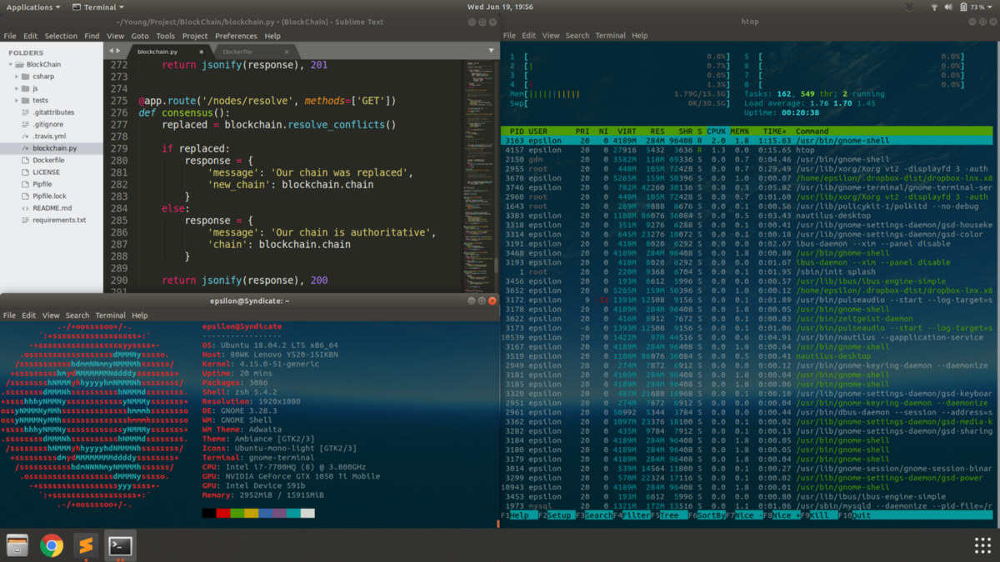
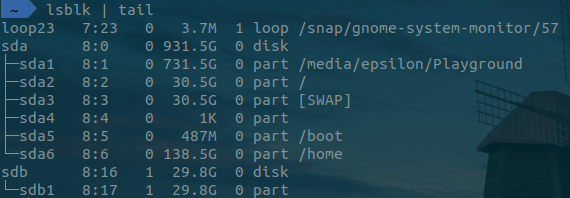
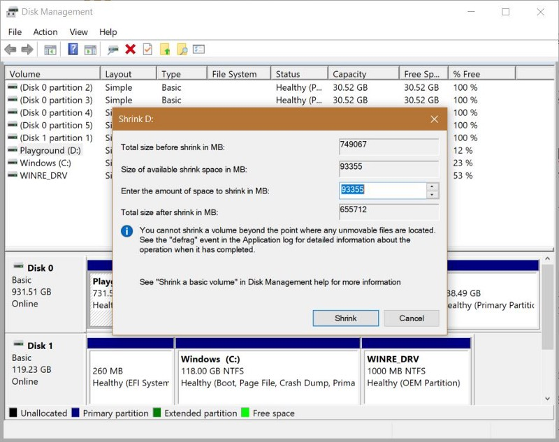
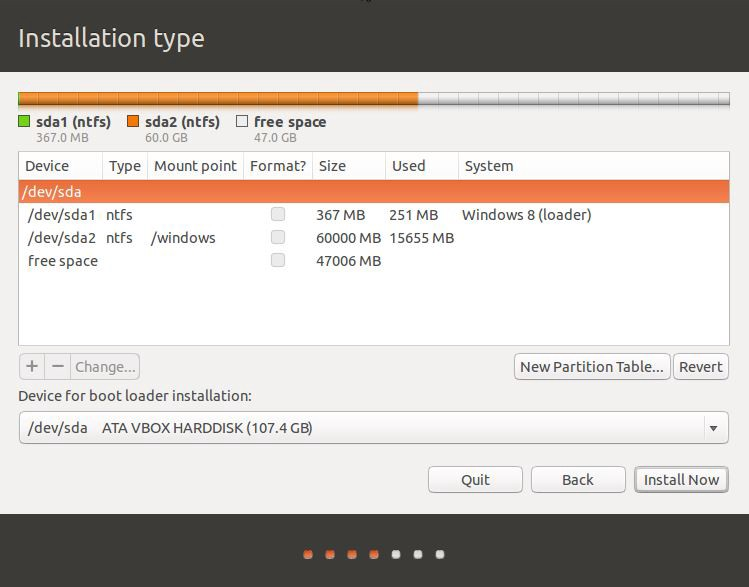
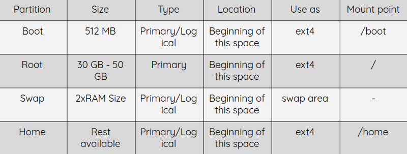

This article is a culmination of 3 years of Ubuntu installation experience. I finally decided to jot down everything I've learnt yet into a guide for beginners as well as those facing the lesser known issues. I've addressed a range of issues, from basic ones to nightmares (faced a lot!)


_My personal desktop with minimal customisation_

## Why Ubuntu?
Cause, statistically speaking it's the most popular open source operating system and highly recommended for beginners. For most of us Linux users, Ubuntu was our first Linux-based operating system. Further, it has a wide user base, strong community support and is more secure than Windows(in terms of the number of malware and virus that exist for an OS). You can also customise your OS to great extents. Want to download a video from a site without going to ad-filled pesky sites? Or add face unlock to your laptop? This OS right here, will make things easier for you.

## Preparation
1. Download the ISO image from [official site](https://medium.com/r/?url=https%3A%2F%2Fubuntu.com%2Fdownload%2Fdesktop).
2. Create a bootable USB drive to install the OS. If you are in a Windows system, use 3rd party USB Installers like [Rufus](https://medium.com/r/?url=https%3A%2F%2Frufus.ie%2F) or [Universal USB Installer](https://medium.com/r/?url=https%3A%2F%2Frufus.ie%2F) and go with the default options(if you build it for Legacy/MBR scheme installation, you might face issues later).

If you are already in a Linux system, make a bootable USB drive using Startup Disk Creator.

For more seasoned users (others can skip to the next point), use `dd` command.
_Caution : If not careful, it can wipe out other partitions entirely._
* Use `lsblk` to locate your USB


_The USB is referenced as sdb1 in this case_

```bash
sudo umount /dev/sdb1
sudo dd bs=4M if=<disk_image>.iso of=/dev/sdb1 conv=fdatasync
```
3. Create an empty partition in the hard disk i.e. separate out some space that will be used exclusively by Linux. If you are in a Windows system, use Disk Management, a powerful and easy-to-use software present by default.

4. Right-click on a partition with enough space and click on Shrink Volume(it will not erase your drive, but will just create another partition out of the blank space). Next, enter the amount of space you want to allocate (100 GB will be fine for beginners) and click on Shrink. Next, right click the new partition and delete the volume to create Unallocated space. Linux users can use GParted and follow the steps [here](https://medium.com/r/?url=https%3A%2F%2Fwww.lifewire.com%2Fuse-gparted-to-partition-hard-drive-2205693).


_Careful while shrinking and deleting partitions :)_

## Installation
Now we are ready to begin the installation. But before that, we need to turn off some Windows features i.e. Fast boot and Secure boot. Follow this [link](https://medium.com/r/?url=https%3A%2F%2Fwww.windowscentral.com%2Fhow-disable-windows-10-fast-startup) and this [link](https://medium.com/r/?url=https%3A%2F%2Fwww.appgeeker.com%2Frecovery%2Fdisable-uefi-secure-boot-in-windows-10.html).

1. Restart the PC and open boot menu to boot from the live USB. F12 is the most common key to open Boot menu, but it can be F2, F10 or Esc also(for Lenovo - F12 and HP - F10).
2. Choose Install Ubuntu option. Skip the options to connect to WiFi or install additional software.
3. In the Installation type step, if you want to keep your Windows installation alongside Ubuntu, select Something else(I prefer to keep Windows alongside Linux as a fail-safe in case things go awry).
4. If you see a dialog box to Continue in UEFI mode(What is that? We'll see soon…) or Go back, click on Go back(you might still be taken to the next step though).
5. You will get the options to create the partitions manually now. You will see your unallocated space on disk here.


**Note** : If the free space turns into unusable after creating a partition, the reason is that you are allowed to make at most 4 Primary partitions and any number of Logical partitions. Your Windows installation is already on a Primary partition and hence, if you face this issue, delete a Primary partition and make it Logical.

6. Follow the trivial instructions next and you should be done!

If you had a successful installation, a big congrats! Welcome to the world of open source operating systems!

If something went wrong, check the section below.

---
> It's not always rainbows and butterflies
>
> --<cite> She will be loved, Maroon 5</cite>

## Troubleshooting
#### 1. Installation got stuck/Stuck on restart after successful completion : 
This often happens due to issues with creation of the Live USB or even the ISO image used. I've also seen this happen if you are trying to install latest OS on relatively old hardware. In such cases, force shutdown and try other methods/software to create the Live USB or change the ISO image.

#### 2. Grub Rescue prompt :
To escape the prompt and boot normally, press Ctrl+Alt+Del. Reason for this error - Live USB wasn't built properly. Check if you have configured the USB with the default settings (UEFI mode installation) while using Rufus or UUI.

#### 3. Unable to Boot into Windows after successful installation :
Restart the PC and go to Advanced options for Ubuntu.
Click on the latest kernel and choose the Recovery mode.
From the recovery menu, select Update GRUB bootloader.

Upon successful update, you should notice that the Windows bootloader was detected along with other options. Restart the PC to get options to select Ubuntu or Windows.
If the above step didn't work or you do not see the GRUB menu at all, you are meant to read this article further(unfortunately).

#### 4. Unable to allocate free space for Linux :

_In your machine, perhaps Windows was installed on the hard drive using Microsoft Logical Disk Manager. LDM is a proprietary format that enables disk volumes to be dynamic, in contrast to the standard basic volume format.
-- Curtis Gedak (taken from an answer on StackOverflow)_

Due to this reason, you might not able to resize/delete partitions.
If your machine ran Windows 10 Anniversary edition out of the box, your disk might be in [Dynamic format](https://medium.com/r/?url=https%3A%2F%2Fwww.easeus.com%2Fresource%2Fdynamic-disk-recovery.htm). You have to convert the Dynamic Disk into Basic Disk using any third party softwares like [AOMEI Partition Assistant](https://medium.com/r/?url=https%3A%2F%2Fwww.disk-partition.com%2Fdownload.html).

### 5. Installation advises me to create an ESP partition :
Windows already has an EFI System Partition which can be seen in 'Disk Management'. You should not create another one explicitly unless it's absolutely necessary(never). If you see this error, you have to create the `/boot` partition as mentioned in the installation procedure previously.

### 6. No GRUB menu/Ubuntu bootloader was not found/Windows starts automatically :
You need boot-repair. Use your Live USB and follow [this](https://help.ubuntu.com/community/Boot-Repair) link from '2nd Option'.

### 7. Ubuntu bootloader was still not found :
Newer systems use UEFI boot mode, while Ubuntu uses Legacy mode. Windows uses an EFI System Partition for the booting and the ESP works for all systems. Possible causes for this error:

1. You have not created the `/boot` partition mentioned before. This partition is primarily for your Ubuntu installation.
2. **Secure boot** is on. If you have not done already, [disable secure boot](https://medium.com/r/?url=https%3A%2F%2Fwww.appgeeker.com%2Frecovery%2Fdisable-uefi-secure-boot-in-windows-10.html).
3. While creating the Ubuntu live USB, you created it for _Legacy installation_ and hence, the UEFI system doesn't recognize a legacy installation. If so, change boot mode to Legacy in your boot manager for Ubuntu and UEFI for Windows.
### 8. Still can't find the Ubuntu bootloader/No GRUB menu :
This is the deepest level of problem I've seen yet.
Most EFI systems use **GUID Partition table**, but perhaps your disk is using **Master Boot Repair** scheme. Easy path is to convert your Live USB into MBR scheme and do a fresh installation. Other way is to convert your disk into **GPT** by following this [link](https://medium.com/r/?url=http%3A%2F%2Fwww.rodsbooks.com%2Fgdisk%2Fmbr2gpt.html).
If you still face any issue, reach out to me and maybe we can get a point 9.

