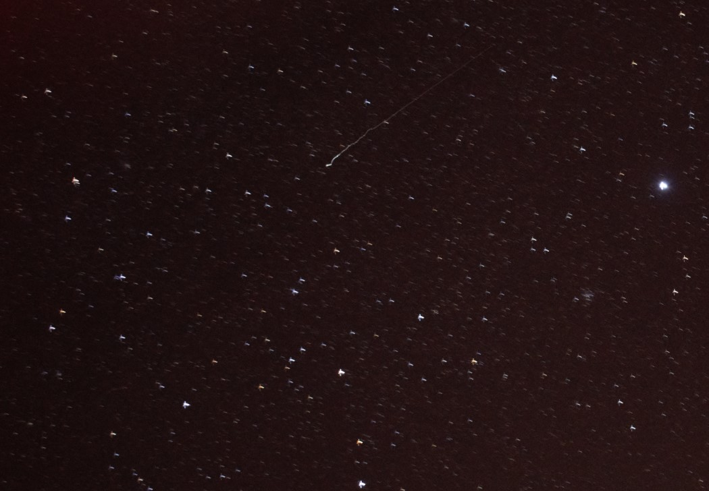
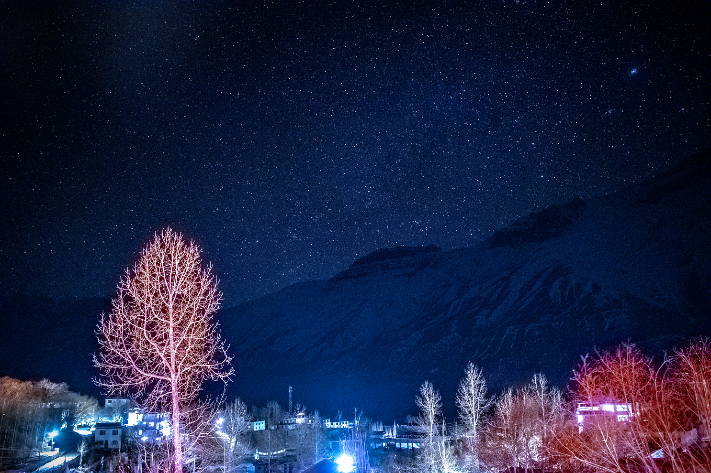
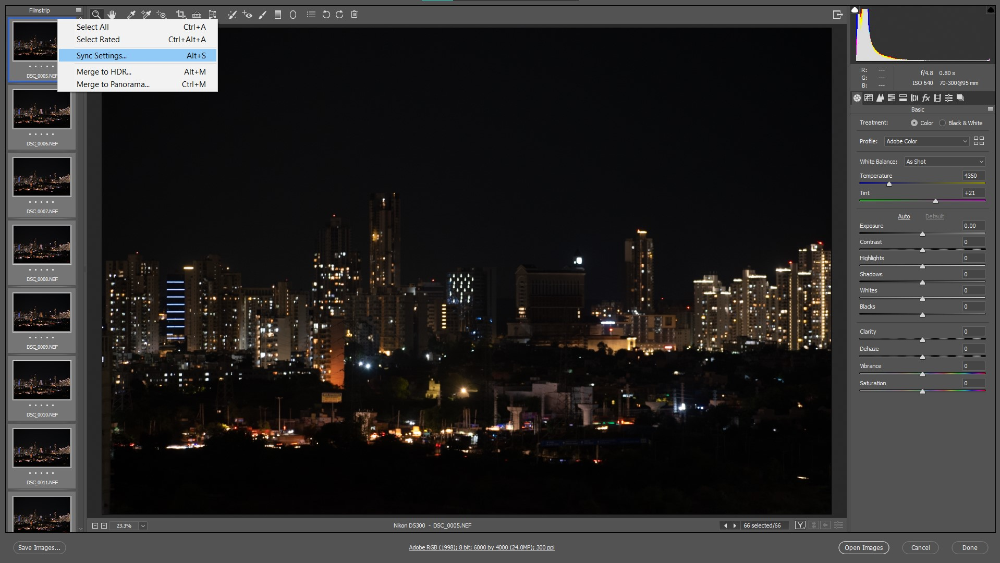
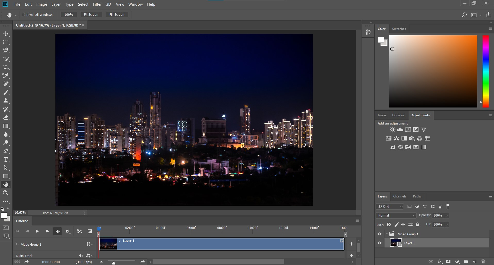
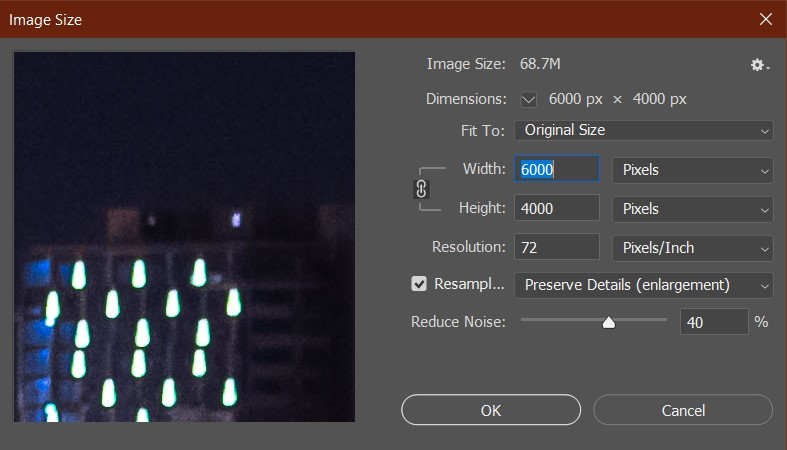
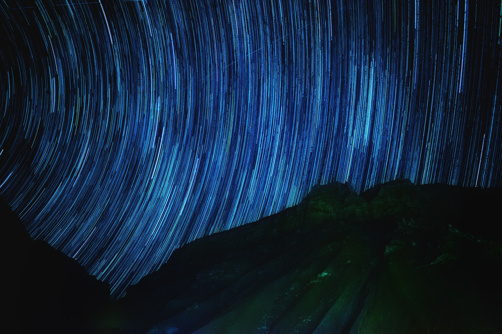
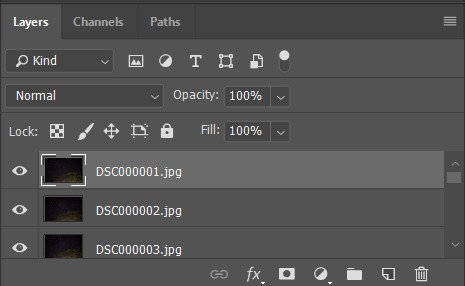
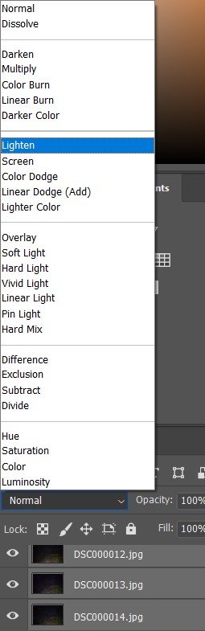

In the April of this year (2021), I travelled to the Spiti valley in Himanchal Pradesh (India) along with four of my friends. Spiti, a cold desert is known for its massive rugged mountains, high altitude villages, snow leopards and clear night skies. I list out my notes and methodology to capture and present the night sky.

## 1. My gear
I own a [*Nikon D5300*](https://www.nikonusa.com/en/nikon-products/product/dslr-cameras/d5300.html). It's apt for entry level photography and fashions a DX Image sensor. I pair my camera with AF-P DX NIKKOR 18-55 mm and 70-300 mm Telephoto lenses. I find myself clicking landscapes more often and while the wide angle 18-55 captures the massive dunes and skies perfectly, I have most fun with the telephoto lens. I also own the [*Digitek DTR 550 LW*](https://www.digitek.net.in/product/DIGITEK%20Lightweight%20Tripod%20DTR%20550LW) tripod. It takes up the  load of a DSLR paired with 300 mm telephoto lens and is light enough (1.5 KGs) to be carried up in long treks or hikes.

Get a 32 GB SD card at least. For a 10 second timelapse at 30 fps, my camera takes up 6.6 GB of RAW images. Carry extra batteries as shoot times can stretch to hours.
*Note : For long exposures and timelapses, tripod is a necessity.*

## 2. Planning the shoot timings
The night sky and milky way is highly sensitive to light pollution. Have a look at the [light pollution map](https://www.lightpollutionmap.info/) before planning on astrophotography at a new location. Apart from light pollution, the phases of moon affect your timings and chances of a bright and immaculate sky.

Unfortunately my restricted travel dates pushed me into the full moon phase and I had pretty limited time to capture the sky in between 8 PM when the sky isn't dark enough to 9:45 PM when the moon is up and washes away the fine dotted photon rays travelling for millions of years escaping gravity in the hope of getting captured by a guy standing on top of a cold windy roof in a pale blue dot.

Also look up for the weather forecasts as clouds will cover up any chances of you catching the arms of a galaxy.

At times I like to think how lucky of our ancient predecessors to devour the sight of a million brilliant lights every night embellished with pink and purple hues, drawing all kinds of tortuous shapes and just resting under the skies, without going through a lot of planning and preparation :)

## 3. Shooting steps
Switch the DSLR into manual mode. Clicking the night sky requires a lot of light and hence, lower _f values_ and higher shutter exposure times. Although I prefer keeping low ISO values to diminish noise, at times I crank it up to 3200. 

#### How to setup manual focus?
Switch to manual focus mode and open up the live view. Zoom into the brightest star you can see and start adjusting the focal ring to get a crisp image. Once achieved, zoom out and freeze the setup.

#### 500 Rule
While clicking images with a shutter speed of the magnitude of 15-30 seconds, the images start capturing the star trails. We do not want the trails in a single image as it distorts the clarity of stars and unless blended with other images to show the complete motion, hold no real value.

500 Rule is a thumb rule to find the optimal shutter speed to avoid star trails. It states that, 500/(crop factor * focal length) should be the optimal shutter speed. For instance, my Nikon DSLR with a DX sensor has a crop factor of 1.5x and hence, for a focal length of 18 mm, my shutter speed should be 500/18*1.5 ~ 18.5 seconds. 

For a subjective art like photography, I do not prefer to go by standard rules, but I state it here just as a rough estimation. After clicking a shot I zoom in to check any trails and adjust my shutter speed accordingly.

#### Calculating waiting time
More frames in a video implies more fluid experience. I like to keep my videos a minimum of 24 fps and preferably 30 fps (the more the better, but I haven't been able to click more than 480 frames at one stretch yet). To create a 10 second time lapse at 30 fps, you need to capture a minimum of 300 images spaced uniformly by a constant time delay. The time delay has to be longer than your shutter speed, otherwise you won't have enough time to take the shot itself. 

#### EXIF
* Focal length : 18 mm
* ISO : 3200
* F-stop : f/3.5
* Shutter : 10 sec

In the above image, the shutter speed was 10 seconds and hence, the time delay had to be more than that and I fixed a 20 second delay. To be on the safer side in case I lose any frames to sudden light flashes, I target a higher number of frames. For instance, to get 300 frames at a 20 second time interval, you need 6000 seconds which is 1 hour 40 minutes at least. You can also space out even longer to get more motion at the cost of more time.

## 4. Making the timelapse
*Note : I use Photoshop CC 2018 for most of the post-processing. It has been used in all of the steps mentioned here*

Once you have all of the frames, I prefer to weed out overexposed or frames and do some HSV corrections and image tuning like exposure, temperature, highlights and shadows. 

#### Initial image edits and conversion to jpeg
* To edit all of the images at once, select all of them and drag them into the title bar of photoshop. This will pop up the RAW image interface
* Once the necessary adjustments are done, select all and sync the settings.

* Save all images as jpeg in a separate folder and with a serial numbering as depicted. Preferably keep an sRGB colorspace as it is the standard setting for videos.

#### Stitching images into a video
* Load all images by File -> Open -> /path/to/folder. Select first image only and check the Image Sequence checkbox. Now open and set the fps.
* In case you do not have the timeline window, turn it up by Window -> Timeline.

* Now in the timeline window, you can play the frames as a video. You can add an audio track as well and sync the audio and video by trimming the bars.
* To set a standard image size i.e. 1080p or 4K, go to Image -> Image Size and resize the image.

* Click on the render button in timeline window and there you have your timelapse.

## 5. Stacking to form the trails
You can also get the more dramatic and wow-inducing star trails in an image. Effectively, you stack up all the images in a sequential order to capture the motion of the stars.

This process is relatively short and simple.
To open the images in a stack, File->Scripts->Load files into stack.

You will get all of the frames in the Layers dash.

In layers dashboard, select all of the frames and switch to _Lighten_, instead of the default _Normal_ layering setting. 

Voila! You got your image stack.
